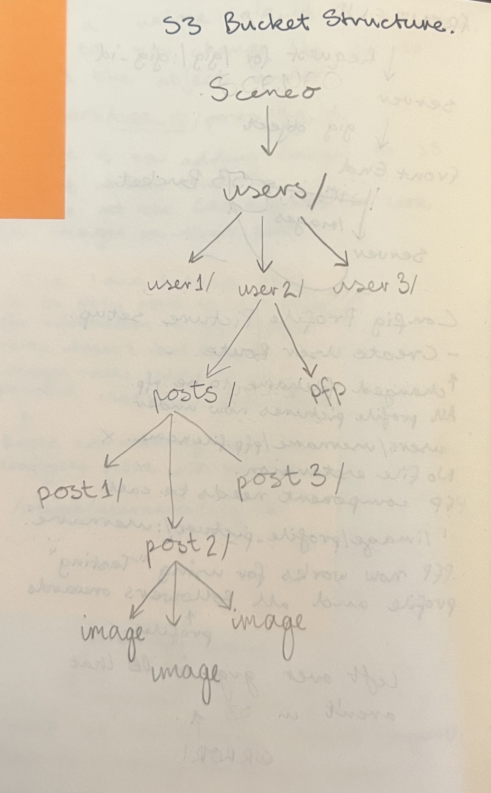
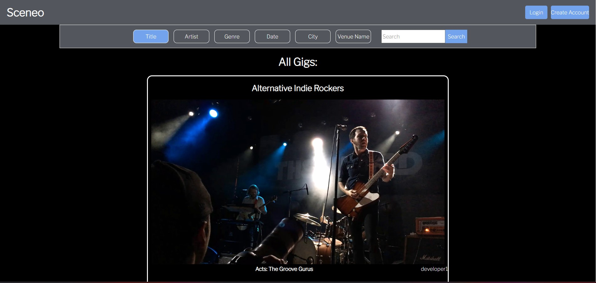
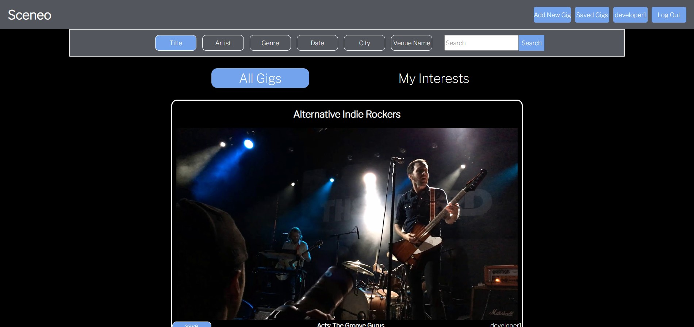
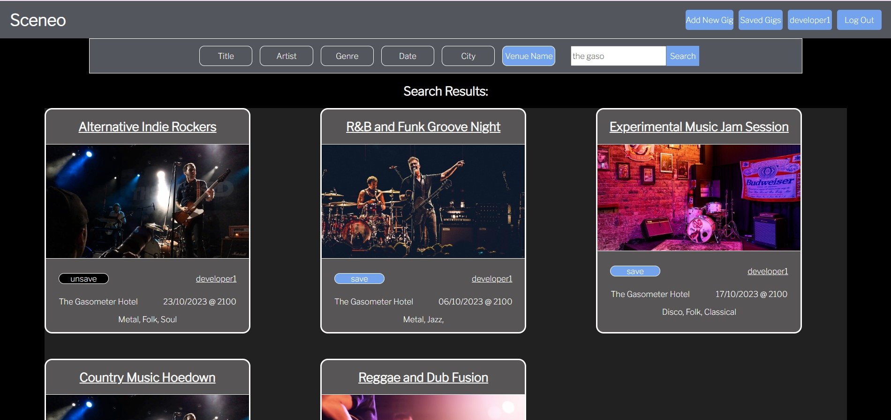
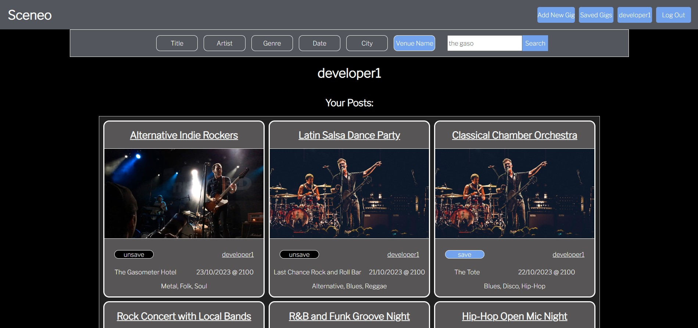
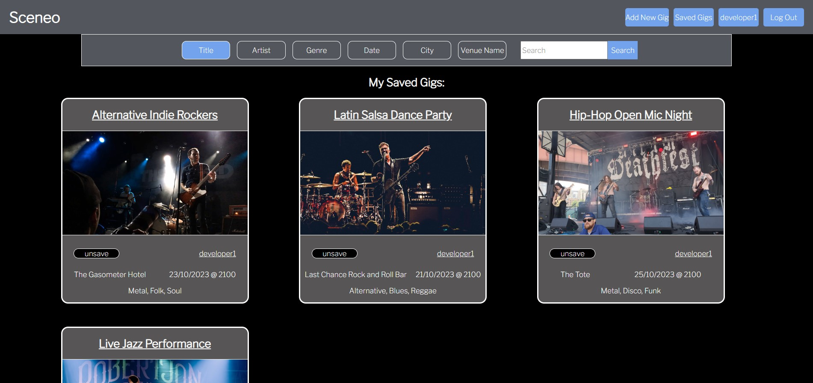

# Sceneo-Server

Welcome to the Sceneo-Server project!

This project is an integral part of Sceneo, a REST API dedicated to providing users with information about upcoming events and gigs in various categories, returning them to the client based on user selected interests.

## Project Overview

This App is meant to provide a way for independent musicians to promote their upcoming gigs to music fans who  would be interested, but otherwise would never know of these gigs existence, when creating an account, you list genres that you are interested in and there will be the ability to see all gigs where any of the listed genres matches that of your interests. Down the line i would like to implement a connection between venue accounts and the artists performing to further promote their interactions with eachother to users.

Throughout this project, I have learned many exciting skills, between multiple AWS services, React Contexts and custom hooks.

I am currently configuring the project to be fully deployed through AWS EC2, AWS Amplify and AWS RDS, The Front end is comprised of ReactJs Code.

The Project Has been a bit of a mammoth admitedly, and will never really be finished, but its now at a point where I am comfortable to show it,

## DataBase Structures:
Images for this web app are stored on an AWS S3 Bucket thus I have written a number of functions to upload, delete and generate presigned urls for the display of these images. 
The Structure of the S3 Bucket is as follows:

The API also makes use of  PSQL database to store and return objects containing details of each gig, with use of join tables and some more advanced querying using PSQL text[] data types.

The Schema for this DB is in db/schema.sql

## Front End Screenshots

### Home Page

### Home Page When Logged into your Account

### Search Results:

### Profile Page:

### Saved Gigs Feature: 

